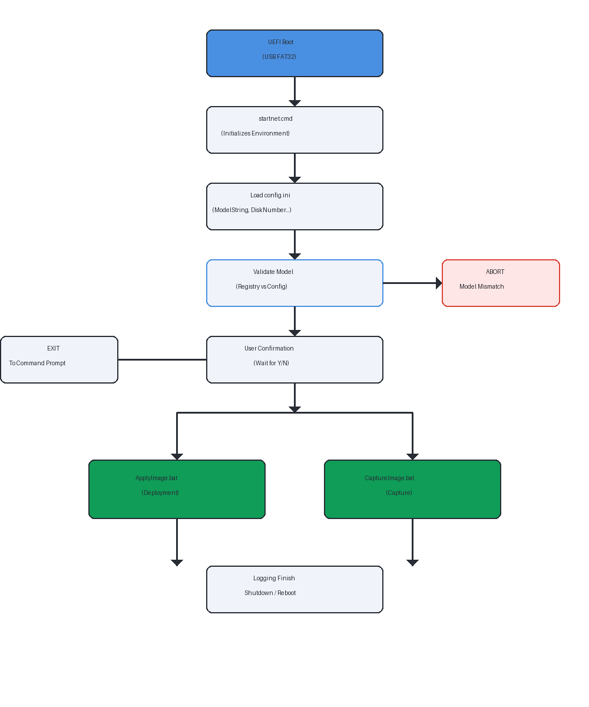

# DeviceRebuild

# Purpose

Automatically rebuild a Windows Device based on a OOBE WIM capture of the model.

# Features

- **Dual-partition USB keys**: WinPE boot partition (FAT32) + Images partition (NTFS)
- **Model validation**: Prevents deployment to wrong device models
- **Split WIM support**: Handles large OS images split into .swm files
- **Driver injection**: Optional offline driver injection for vanilla Windows images
- **OOBE BypassNRO**: Skip the network requirement during Windows setup
- **Comprehensive logging**: Timestamped log files for troubleshooting
- **Safety checks**: Prevents accidental formatting of the USB key itself (DEPLOYKEY.marker)
- **WinRE configuration**: Automatic Windows Recovery Environment setup with Rapid Storage driver injection
- **Push Button Reset**: Automatic configuration of ResetConfig.xml for factory reset capability

# Use Cases

## 1. Clean Install from Microsoft ISO (with Driver Injection)

Rebuild a device from a vanilla Windows image downloaded from Microsoft, with manufacturer drivers injected offline.

**When to use:** You want a clean Windows installation with the correct drivers for a specific hardware model.

**Steps:**

1. **Download Windows ISO** from Microsoft, then run `ExtractWim.ps1` to extract the Pro edition into `Windows_WIM_Root` automatically or extract `install.wim` manually from the `sources` folder of the ISO
2. **Rename the WIM** to match the naming convention: `ModelName-OS.wim` (e.g., `B9450FA-OS.wim`)
3. **Prepare drivers** from the manufacturer website:
   - Download driver packages for your model (Chipset, Graphics, Network, Audio, Storage, etc.)
   - Extract them so that `.inf` files are accessible
   - Place them in a folder structure on the USB key:
     ```
     I:\Drivers\B9450FA\
     ├── Chipset\
     │   └── *.inf
     ├── Graphics\
     │   └── *.inf
     ├── Network\
     │   └── *.inf
     ├── Audio\
     │   └── *.inf
     └── Rapid Storage\    (important for NVMe/RAID devices)
         └── *.inf
     ```
4. **Place the WIM file** at the root of the USB NTFS partition (`I:\`)
5. **Edit `config.ini`**:
   ```ini
   ModelString=B9450FA
   targetScript=ApplyImage.bat
   DiskNumber=0
   BypassNRO=1
   ```
6. **Boot the target device** from the USB key and confirm deployment
7. The script will: partition the disk, apply the OS image, inject drivers, configure boot files, set up WinRE, and shut down
8. On next boot the device enters OOBE for a fresh Windows setup

> [!NOTE]
> For NVMe/RAID devices, include Rapid Storage drivers in `Drivers\ModelName\Rapid Storage\`. These will be automatically injected into `winre.wim` so that Windows Recovery can access the disk.

> [!NOTE]
> Since there is no captured RECOVERY or MYASUS partition, the script will skip those and set up WinRE from the `winre.wim` included in the OS image.

## 2. Factory Capture (Before OOBE)

Capture a brand-new device at first boot, before starting OOBE. This preserves the exact factory state including all manufacturer partitions (Recovery, vendor partitions like MyASUS). You can later re-apply these images to restore the device to its factory condition.

**When to use:** You just received a new device and want to create a factory backup before using it, so you can reset to factory state at any time without relying on the manufacturer's recovery solution.

**Steps:**

1. **Do NOT start the device normally** - interrupt the boot before OOBE begins
2. **Boot from the USB key** (e.g., _Reboot + Esc_ or _F2 + F8_ on ASUS devices)
3. **Identify the disk layout** using `diskpart` → `list disk` → `list volume` to find the correct drive letters for each partition
4. **Create `Mount-AllLetters.txt`** (diskpart script) to assign the expected drive letters: W: (Windows), S: (System), R: (Recovery), M: (MyASUS)
5. **Edit `config.ini`**:
   ```ini
   ModelString=B9450FA
   targetScript=CaptureImage.bat
   DiskNumber=0
   ```
6. **Boot from USB and confirm** - the script captures all partitions to individual WIM files:
   - `B9450FA-OS.wim` - Windows partition
   - `B9450FA-SYSTEM.wim` - EFI System partition
   - `B9450FA-RECOVERY.wim` - Recovery partition
   - `B9450FA-MYASUS.wim` - Vendor partition
7. **Copy the WIM files** to your storage repository for future use

> [!TIP]
> No driver injection is needed when re-applying these images since they already contain all manufacturer drivers from the factory installation.

> [!TIP]
> If the OS WIM is too large for FAT32 constraints (>4GB), split it for storage: `Dism /Split-Image /ImageFile:B9450FA-OS.wim /SWMFile:B9450FA-OS.swm /FileSize:4000`. ApplyImage.bat automatically detects and handles split images.

## 3. Dirty Snapshot (For Benchmarking)

Capture a device after installing benchmark tools and optimizing settings, without running sysprep. This creates a "dirty" snapshot that can be quickly re-applied to reset the device to a known benchmark-ready state between test runs.

**When to use:** You have a device configured specifically for benchmarking (tools installed, settings optimized, background services disabled, etc.) and need to reset it to this exact state before each new test run.

**Steps:**

1. **Set up the device** for benchmarking:
   - Install all benchmark tools and utilities
   - Optimize Windows settings (disable updates, telemetry, background apps, etc.)
   - Configure power plans, display settings, etc.
   - Run through one test cycle to ensure everything works
2. **Shut down the device** cleanly
3. **Boot from the USB key**
4. **Edit `config.ini`** to capture:
   ```ini
   ModelString=B9450FA
   targetScript=CaptureImage.bat
   DiskNumber=0
   ```
5. **Run the capture** - all partitions are saved as WIM files
6. **After each benchmark run**, re-apply the snapshot:
   - Change `config.ini`: `targetScript=ApplyImage.bat`
   - Boot from USB - the device is restored to the exact benchmark-ready state
   - No OOBE, no driver installation, no reconfiguration needed

> [!NOTE]
> This is called a "dirty" snapshot because no sysprep is performed. The captured image retains the machine's SID, user profiles, and installed software exactly as configured. This is perfectly fine for benchmarking where you're always re-applying to the same physical device.

# Boot Workflow

When booting from a produced USB key, the `startnet.cmd` script automatically orchestrates the environment setup and validation before handing over to the deployment or capture scripts.



# Configuration

## config.ini (USB key - runtime settings)

Edit this file before each operation:

| Variable | Description |
|----------|-------------|
| `ModelString` | Device model name (typically 6-8 characters, e.g., `B9450FA`) |
| `targetScript` | Script to execute: `ApplyImage.bat` or `CaptureImage.bat` |
| `DiskNumber` | Target disk number (use `diskpart` → `list disk` to find it) |
| `BypassNRO` | Set to `1` to skip network requirement during OOBE (optional) |
| `EditionIndex` | WIM edition index to apply (default `1`). Auto-set by `ProduceKey.ps1` when copying a multi-edition WIM. Use `dism /Get-ImageInfo /ImageFile:<wim>` to list available indices. |

> [!WARNING]
> If the ModelString doesn't match the device's SystemProductName, deployment will abort. This safety feature prevents accidental data loss. Always verify `DiskNumber` is correct - if the USB is disk 0, set `DiskNumber` to the internal disk number (often 1).

## config.psd1 (workstation - build-time paths)

Edit before running any workstation script:

```powershell
@{
    "WinPE_WIM_Location"       = "C:\Path\to\WinPE.wim"
    "Device_Root_WIM_Location" = "C:\Path\to\ModelWIMs"
    "Windows_WIM_Root"         = "C:\Path\to\WindowsWIMs"
    "Shared_Drivers_Location"  = "C:\Path\to\SharedDrivers"
    "Default_OS_Version"       = "25H2"
    "Target_Models"            = @("B1403CVA", "B5402CB")
}
```

| Key | Description |
|-----|-------------|
| `WinPE_WIM_Location` | Root directory of the WinPE library populated by `CreatePE.ps1` (each subdir contains a `boot.wim`) |
| `Device_Root_WIM_Location` | Root of the model WIM library (one subdirectory per model) |
| `Windows_WIM_Root` | Root of the vanilla Windows WIM library populated by `ExtractWim.ps1`. |
| `Shared_Drivers_Location` | Root directory for shared driver packages. `GetDriver.ps1` default root. |
| `Default_OS_Version` | The OS version used by `RefreshDrivers.ps1` for updates (e.g., `25H2`). |
| `Target_Models` | Optional array of models for `RefreshDrivers.ps1` to maintain. |

# USB Key Generation

## Prerequisites

- USB key 16GB+ (32GB recommended for multiple models)
- WinPE WIM file with custom startnet.cmd (see WinPE section)
- Windows ADK installed
- Administrator privileges

## ProduceKey.ps1

USB Key Creation Tool for Windows Device Imaging. Supports dual-partition USB (WinPE boot + NTFS storage).

```powershell
# Interactive (no log file)
.\ProduceKey.ps1

# With log file
.\ProduceKey.ps1 -Log
```

| Parameter | Description |
|-----------|-------------|
| `-Log` | Enable timestamped logging to the current directory. |

The script guides you through five steps in order. Each step is optional — you can skip steps you don't need:

| Step | Action | Notes |
|------|--------|-------|
| 1 | **Format USB** | Creates dual-partition structure (FAT32 WinPE + NTFS Images) and optionally applies WinPE |
| 2 | **Apply WinPE** | Applies a PE from the library to an existing partition (if Step 1 was skipped) |
| 3 | **Update startnet.cmd** | Refreshes only `startnet.cmd` inside `boot.wim` on an existing WinPE partition — without re-applying the whole image |
| 4 | **Copy scripts** | Copies deployment scripts (`ApplyImage.bat`, `CaptureImage.bat`, `config.ini`, etc.) to the Images partition |
| 5 | **Copy model WIMs** | Copies WIM files for a selected model; auto-detects Pro edition index and updates `config.ini` |

# Workstation Tooling Scripts

These scripts run on your workstation (not in WinPE) to build and maintain the WIM library used during key production. They all share a common module (`DeviceRebuild.psm1`) and read paths from `config.psd1`.

## RefreshDrivers.ps1

Automates the maintenance of the shared driver library by checking for updates via `GetDriver.ps1`.

```powershell
# Check for updates and download new versions automatically
.\RefreshDrivers.ps1 -Log

# Dry run to check for updates without downloading
.\RefreshDrivers.ps1 -DryRun
```

| Parameter | Description |
|-----------|-------------|
| `-Log` | Enable timestamped logging to the current directory. |
| `-DryRun` | Performs version checking and comparison but skips all file operations (backup, download, extraction). |

**Logic:**
1.  **Discovery**: Scans `Shared_Drivers_Location` subdirectories or uses `Target_Models` from `config.psd1`.
2.  **Inference**: Reads the SCCM ReleaseNote `.xlsx` in each model folder to extract the local version (e.g., `01.02`).
3.  **Comparison**: Queries `GetDriver.ps1` for the latest available version (defaulting to `Default_OS_Version`).
4.  **Update**: If a newer version exists, the current content is moved to a temporary `olddrv` folder.
5.  **Download**: The new version is downloaded and expanded into the model folder.
6.  **Safety**: If successful, `olddrv` is deleted. If download fails, the old version is restored.

---

## GetDriver.ps1

Automated downloader for **SCCM Driver Packages** from the ASUS Support site.

```powershell
# Interactive selection (downloads to Shared_Drivers_Location\<Model>)
.\GetDriver.ps1 -Model "BM1403CDA"

# Dry run to verify logic (skips download and extraction)
.\GetDriver.ps1 -Model "BM1403CDA" -DryRun
```

| Parameter | Description |
|-----------|-------------|
| `-Model` | Device model name (e.g., `BM1403CDA`). |
| `-OSVersion` | Target OS version filter (e.g., `24H2`). Defaults to `25H2`. |
| `-Version` | Specific version string (e.g., `1.0.0`) to download (disables selection menu). |
| `-Destination` | The root directory under which the model-named folder is created. Defaults to `Shared_Drivers_Location` from `config.psd1`. |
| `-AutoExpand` | Controls extraction and ZIP deletion. Defaults to `$true`. |
| `-GetLatestVersion` | Returns a JSON object with `{Version, OSVersion}` and exits. |
| `-DryRun` | Performs all logic (search, selection, resolution) but skips the actual download and extraction. |

---

## CreatePE.ps1

Builds a fully customized WinPE using the Windows ADK.

```powershell
# Build and/or apply a customized WinPE
.\CreatePE.ps1 -Log
```

| Parameter | Description |
|-----------|-------------|
| `-Log` | Enable timestamped logging to the current directory. |

---

## ExtractWim.ps1

Extracts the **Pro** and **Pro Education** editions from a Windows ISO into the library.

```powershell
# With ISO path
.\ExtractWim.ps1 -IsoPath "C:\ISOs\Win11_24H2.iso" -Log
```

| Parameter | Description |
|-----------|-------------|
| `-IsoPath` | Full path to the Windows ISO file. |
| `-Log` | Enable timestamped logging to the current directory. |

---

## dism_diag.ps1

Diagnostic utility for troubleshooting DISM operations and WIM mounts.

```powershell
# Check for stuck DISM processes and mounted images
.\dism_diag.ps1
```

---

# WIM File Naming Convention

**Naming format:** `ModelName-PartitionType.wim`

| Partition Type | Description |
|---------------|-------------|
| OS | Windows system partition |
| RECOVERY | Windows Recovery Environment |
| MYASUS | ASUS vendor partition (optional) |
| SYSTEM | EFI system partition (rebuilt by bcdboot) |

# Safety Features

## USB Key Protection

The script creates `DEPLOYKEY.marker` on the USB key. Before partitioning, ApplyImage.bat:
1. Checks all partitions on the target disk for this marker
2. If found, **aborts** with clear error message
3. Prevents accidental USB key destruction

## Model Validation

startnet.cmd validates that `ModelString` appears in the device's `SystemProductName` registry value before proceeding. Deployment is aborted on mismatch.

## User Confirmation

Before executing the target script, startnet.cmd displays a summary and asks for explicit `Y/N` confirmation.

# Log Files

All operations create timestamped log files on the USB key:

| Log File | Description |
|----------|-------------|
| `Startnet_*.log` | WinPE boot, config loading, model validation |
| `ApplyImage_*.log` | Partition creation, image deployment, driver injection |
| `CaptureImage_*.log` | Partition capture operations |
